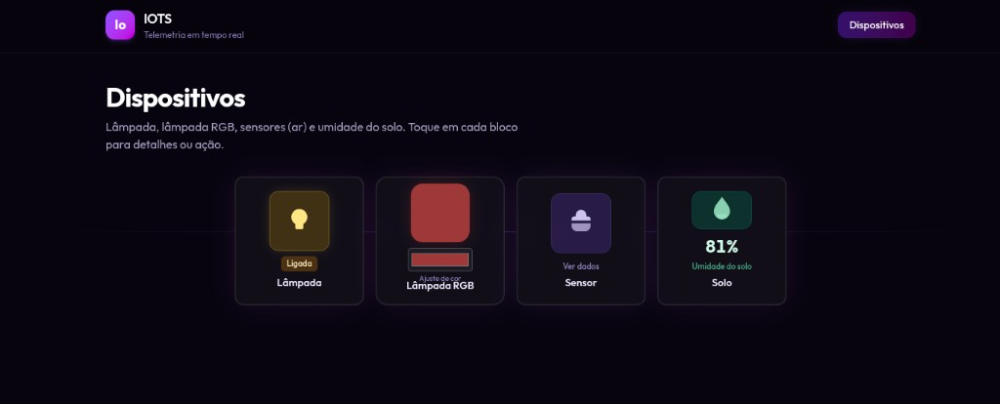
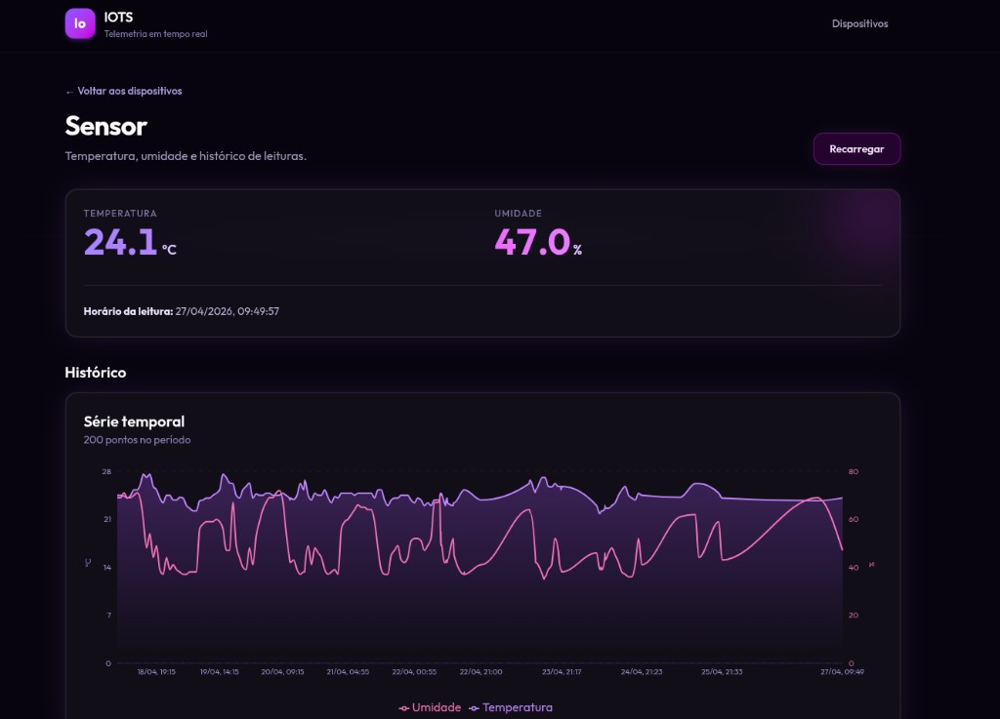
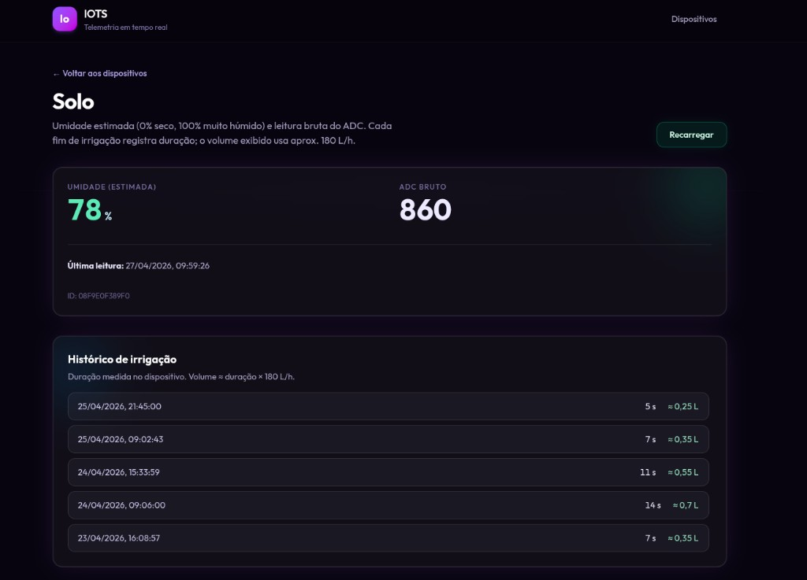
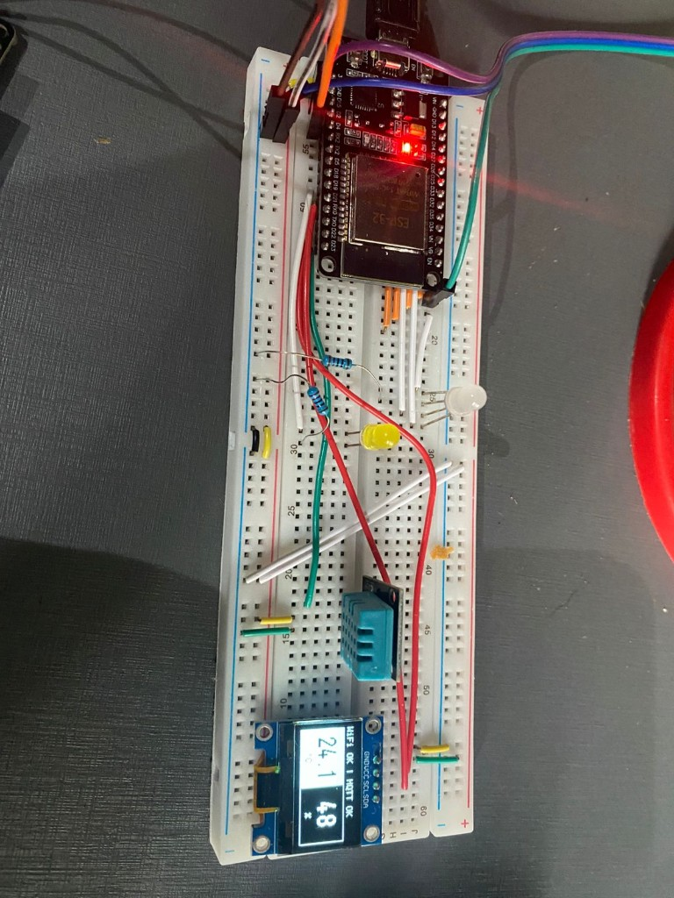
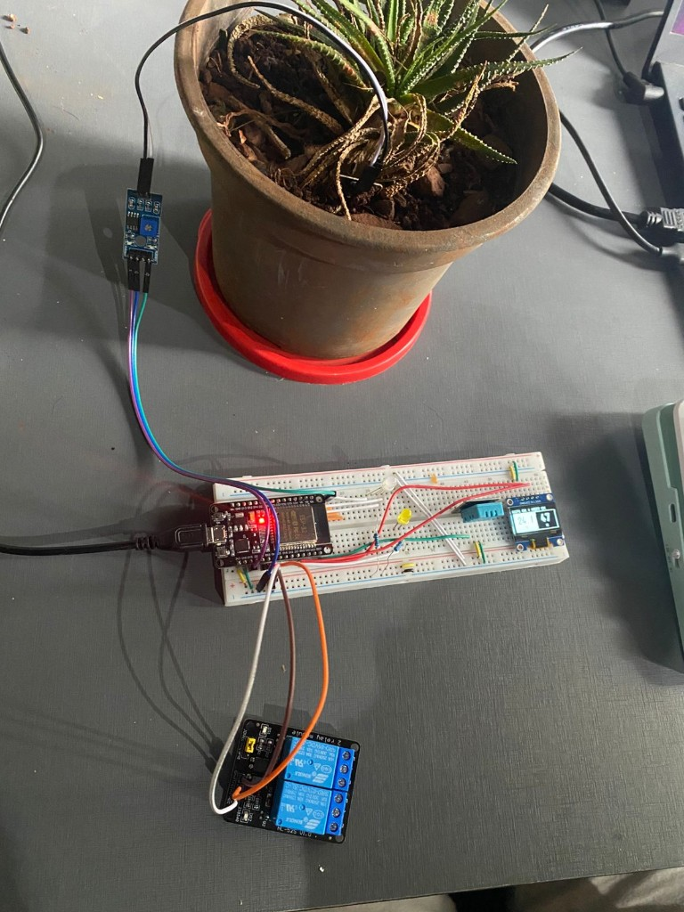

# IOTS

Plataforma IoT para monitoramento ambiental e automacao local com ESP32, integrada a um backend em NestJS e uma interface web em React.

O projeto combina:
- telemetria de temperatura/umidade do ar;
- leitura de umidade do solo;
- controle remoto de lampada simples e lampada RGB;
- irrigacao automatica no proprio dispositivo, com historico no backend.

## Ideia do projeto

A ideia central e ter um sistema de baixo custo para ambiente residencial/laboratorial que:
- coleta dados do ambiente em tempo real;
- permite acionar atuadores remotamente;
- mantem autonomia local no microcontrolador (ex.: irrigacao continua mesmo sem frontend aberto);
- registra historico para consulta e analise posterior.

Em resumo: o microcontrolador executa as acoes de campo, o backend orquestra/normaliza dados e comandos, e o frontend oferece visibilidade e controle.

Visao geral da interface:

## Regras de negocio implementadas

### 1) Controle remoto de atuadores

- O usuario consegue ligar/desligar a lampada comum diretamente pela interface.
- A lampada RGB pode ser ligada/desligada e ter a cor ajustada de forma visual.
- Quando um comando e enviado, o sistema confirma o novo estado para manter a tela sincronizada com o dispositivo real.

### 2) Monitoramento continuo do ambiente

- O sistema acompanha temperatura e umidade do ar ao longo do tempo.
- O usuario ve tanto o valor mais recente quanto o historico para observar tendencia.
- Caso ainda nao haja leitura para um dispositivo, a interface mostra esse estado de forma explicita.

### 3) Monitoramento de solo

- Cada dispositivo informa o nivel de umidade do solo em percentual estimado.
- A tela de solo mostra o estado atual e a hora da ultima atualizacao.
- O objetivo e facilitar decisoes de irrigacao com base em dado atual, e nao somente percepcao manual.

### 4) Irrigacao automatica com autonomia local

- A irrigacao e decidida no proprio microcontrolador, sem depender da interface estar aberta.
- Quando o solo esta seco, a irrigacao e iniciada automaticamente.
- Quando o solo recupera umidade suficiente, a irrigacao e encerrada automaticamente.
- O ciclo usa uma faixa de liga/desliga para evitar ficar oscilando em curtos intervalos.
- Existe limite de seguranca para impedir irrigacao continua em caso de leitura anomala.

### 5) Rastreabilidade e historico

- Leituras e eventos importantes (como ciclos de irrigacao) ficam registrados para consulta posterior.
- O historico permite entender o comportamento do ambiente, validar ajustes e apoiar melhorias na calibracao.
- A interface usa esses registros para apresentar evolucao temporal, e nao apenas um "snapshot" instantaneo.

### 6) Comportamento em falhas e consistencia

- O sistema tenta manter operacao resiliente: se houver oscilacao de rede, o dispositivo continua executando regras locais.
- Dados e estados sao normalizados para evitar duplicidade/inconsistencia entre tela, backend e dispositivo.
- Entradas invalidas de comando sao bloqueadas para proteger o atuador e manter previsibilidade operacional.

## Arquitetura geral

O repositorio esta organizado em tres modulos principais:

- `microcontroller/`  
  Firmware ESP32 (PlatformIO + Arduino): sensores, atuadores, Wi-Fi, MQTT e logica local.

- `backend/`  
  API HTTP + microservico MQTT em NestJS, persistencia em PostgreSQL (TypeORM), publicacao de comandos MQTT.

- `frontend/`  
  Aplicacao React Router que consome a API HTTP para visualizacao de dados e envio de comandos.

## Comunicacao entre componentes

### 1) Fluxo de dados (dispositivo -> backend -> frontend)

1. O ESP32 publica mensagens MQTT com `deviceId` e leituras.
2. O backend assina os topicos MQTT, valida/normaliza payload e persiste no PostgreSQL.
3. O frontend consulta a API HTTP periodicamente (polling) para mostrar estado atual e historico.

### 2) Fluxo de comando (frontend -> backend -> dispositivo)

1. Usuario aciona lampada/lampada RGB na UI.
2. Frontend envia `POST` para endpoints de `devices`.
3. Backend valida entrada e publica comando MQTT em `.../command`.
4. ESP32 recebe o comando, aplica no hardware e publica estado em `.../state`.
5. Backend atualiza o estado persistido para refletir a ultima situacao conhecida.

### 3) Topicos MQTT

Prefixo base:

- `iots/device/{deviceId}/...`

Topicos utilizados:

- `.../telemetry` -> temperatura e umidade do ar;
- `.../soil` -> umidade do solo (ADC bruto + percentual estimado);
- `.../irrigation` -> eventos de irrigacao (duracao em ms);
- `.../state` -> estado da lampada e da lampada RGB;
- `.../command` -> comandos enviados ao dispositivo.

## Persistencia de dados (PostgreSQL)

Principais tabelas:

- `telemetry_readings` -> historico de temperatura/umidade;
- `device_states` -> ultimo estado por dispositivo/canal (`lamp`, `lamp_rgb`);
- `device_soil` -> ultimo estado de umidade do solo por dispositivo;
- `device_irrigation` -> historico de sessoes de irrigacao.

## Visao da interface web

O frontend apresenta:
- lista de dispositivos detectados a partir de telemetria + solo;
- controle de lampada simples e RGB;
- tela de sensor com metricas atuais e historico;
- tela de solo com leitura atual e historico de irrigacao (incluindo estimativa de volume).

Atualizacao de dados na UI e feita por polling em intervalos curtos (ex.: 10-15s, dependendo da tela/componente).

## Configuracao basica

### Backend (`backend/.env`)

Variaveis mais importantes:
- `DATABASE_URL` (obrigatoria);
- `MQTT_URL` (default: `mqtt://127.0.0.1:1883`);
- `PORT` (default: `3000`);
- `CORS_ORIGIN` (origens separadas por virgula);
- `DATABASE_SYNC` (`true/false`, recomendado `false` em ambiente persistente).

### Frontend

- `VITE_API_URL` aponta para a API (default local: `http://localhost:3000`).

### Microcontrolador

- copiar `microcontroller/include/secrets.example.h` para `microcontroller/include/secrets.h`;
- definir `WIFI_SSID`, `WIFI_PASS`, `MQTT_HOST`, `MQTT_PORT`, `MQTT_TOPIC_PREFIX` e tipo do DHT;
- compilar/subir via PlatformIO no ambiente `esp32doit-devkit-v1`.

## Observacoes importantes

- A automacao de irrigacao e local no ESP32: continua ativa mesmo sem frontend.
- Backend e frontend sao desacoplados do hardware por meio de MQTT + API HTTP.
- O projeto foi desenhado para evolucao incremental: novos sensores/canais podem seguir o mesmo padrao de topico, ingestao e persistencia.

## Galeria do projeto

### Interface web

Tela de sensor (leituras e historico):

Tela de solo (estado atual e historico de irrigacao):

### Hardware

Protoboard com ESP32, sensores e display OLED:

Montagem completa com sensor de solo e modulo de rele:

